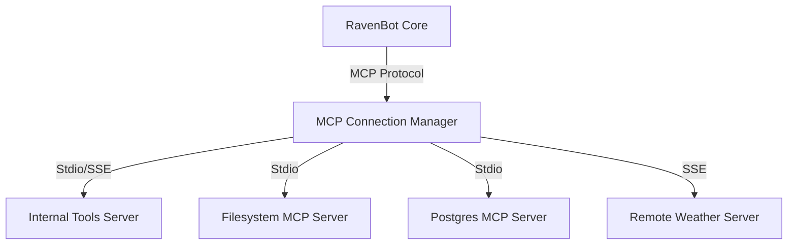

# Ravenbot MCP Architecture

## Overview
To make `ravenbot` truly extensible and capable of leveraging the growing ecosystem of AI tools, it uses the **Model Context Protocol (MCP)**. This allows `ravenbot` to connect to external tools (servers) without modifying its core code.

## Architecture
`ravenbot` acts as an **MCP Client** (Host).



## Key Components

### 1. Configuration (`internal/config`)
MCP servers are defined in a `config.json` file.
```json
{
  "mcpServers": {
    "filesystem": {
      "command": "npx",
      "args": ["-y", "@modelcontextprotocol/server-filesystem", "."]
    }
  }
}
```

### 2. MCP Client (`internal/mcp`)
The Go implementation of the MCP Client:
- **Transport**: Supports `stdio` (executing a command and talking over stdin/stdout).
- **Protocol**: JSON-RPC 2.0.
- **Lifecycle**: Handles `initialize`, `tools/list`, and `tools/call`.

### 3. Tool Mapping (`internal/agent`)
The `Agent` dynamically registers these tools with Gemini:
- Iterates over connected MCP servers.
- Fetches tool definitions (`name`, `description`, `input_schema`).
- Converts JSON Schema to `genai.Schema`.
- Namespaces tool names as `serverName_toolName` to avoid collisions.

### 4. Execution Router
When Gemini returns a `FunctionCall`:
- Routes to native tools (e.g., `FetchRSS`) or namespaced MCP tools.
- MCP calls are dispatched to the appropriate server via the connection manager.

## Usage
To add an MCP server, create or edit `config.json` in the root directory:
```json
{
  "mcpServers": {
    "filesystem": {
      "command": "npx",
      "args": ["-y", "@modelcontextprotocol/server-filesystem", "/home/user/allowed/path"]
    },
    "git": {
      "command": "npx",
      "args": ["-y", "@cyanheads/git-mcp-server"]
    },
    "github": {
      "command": "npx",
      "args": ["-y", "@modelcontextprotocol/server-github"]
    }
  }
}
```

## Benefits
1.  **Zero-Code Extension**: New tools can be added just by editing a config file.
2.  **Security**: MCP servers run in their own processes, isolating tool execution.
3.  **Ecosystem**: Instant access to the official MCP server list (Google Drive, Slack, GitHub, SQLite, etc.).