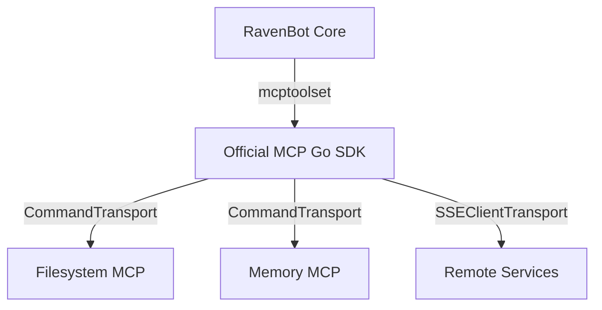

# Ravenbot MCP Architecture

## Overview
To make `ravenbot` truly extensible and capable of leveraging the official ecosystem of AI tools, it uses the **Model Context Protocol (MCP)** via the official Go SDK. This allows `ravenbot` to connect to external tools (servers) using industry-standard transports.

## Architecture
`ravenbot` acts as an **MCP Host** using the `google.golang.org/adk/tool/mcptoolset` package.



## Key Components

### 1. Configuration (`config.json`)
MCP servers are defined centrally. The agent automatically initializes these during startup.
```json
{
  "mcpServers": {
    "filesystem": {
      "command": "npx",
      "args": ["-y", "@modelcontextprotocol/server-filesystem", "/src", "/app"]
    }
  }
}
```

### 2. Official Toolsets (`google.golang.org/adk/tool/mcptoolset`)
Instead of a custom client, RavenBot uses the ADK's native `mcptoolset`:
- **Standard Transports**: Leverages `mcp.CommandTransport` for local processes and `mcp.SSEClientTransport` for remote streams.
- **Auto-Discovery**: Automatically queries servers for their available tools and capabilities.
- **Schema Mapping**: Converts MCP tool schemas into Gemini-compatible function declarations.

### 3. Agent Integration
Toolsets are injected into sub-agents (e.g., `SystemManager`, `Jules`) allowing them to select and invoke the most relevant tools for their specific domain.

## Benefits
1.  **Production Grade**: Built on the official `modelcontextprotocol/go-sdk`, ensuring compliance with the evolving spec.
2.  **Robust Transports**: Handles process lifecycles and stream reconnections natively.
3.  **Unified Tooling**: MCP tools appear to the agent exactly like native Go functions, allowing for seamless reasoning.

## Usage
To add a new capability, simply add the server to `config.json`. For example, to add Google Maps support:
```json
"google-maps": {
  "command": "npx",
  "args": ["-y", "@modelcontextprotocol/server-google-maps"]
}
```
RavenBot will discover the new tools on the next restart and make them available to the sub-agents.
